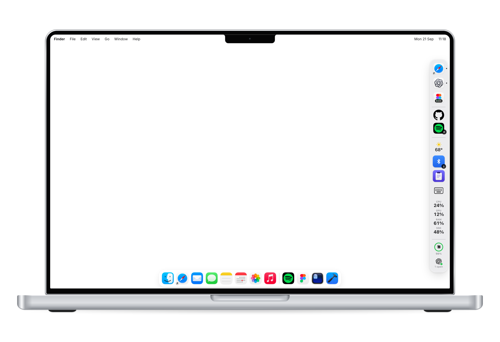

# context

[](https://github.com/smeltery/context/actions/workflows/ci.yml)
[](https://github.com/smeltery/context/actions/workflows/release.yml)
[](LICENSE)
[](https://bun.sh/)
[](packages/core)
[](macos)
[](docs/getting-started.md)
[](apps/web)
[](.pre-commit-config.yaml)
[](https://flox.dev)

A second dock for your Mac — apps, links, clipboard history, and live widgets on the screen edge.

<p align="center">
  
</p>

## Quick start

```bash
flox activate   # optional
bun install
bun run dev     # marketing site
cd macos && swift build --product Context && open .build/debug/Context
```

Or download a build from [Releases](https://github.com/smeltery/context/releases).

## Docs

Guides, architecture diagrams, and development notes live in [`docs/`](docs/README.md).

## License

[PolyForm Shield 1.0.0](LICENSE)
