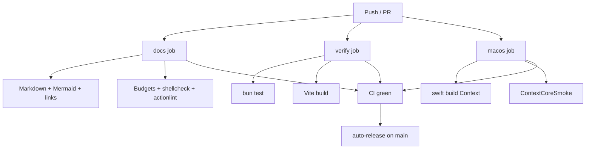

# CI

Continuous integration runs on every push and pull request to `main`.

## Jobs

| Job | Runner | What it runs |
|-----|--------|--------------|
| `docs` | GitHub-hosted Ubuntu | flox activate, `check-docs.sh`, `check-hygiene.sh` |
| `verify` | GitHub-hosted Ubuntu | `check-node.sh` |
| `macos` | GitHub-hosted macOS 15 | Swift build + smoke (+ `swift test` when Xcode exists) |

Flox is installed in Linux jobs so the same `manifest.toml` tools used locally are proven in CI. Bun 1.4.2 is also set up via `oven-sh/setup-bun` so the lockfile version is exact even if the catalog lags.
