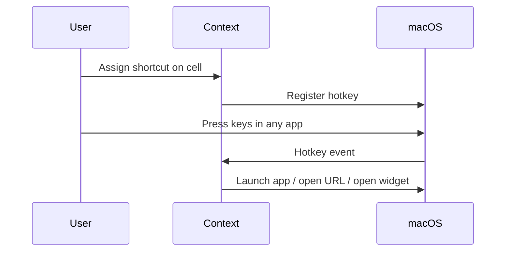

# Customization

Everything is meant to be rearrangeable without a setup wizard.

## Appearance

- Edge: left or right
- Theme: light or dark (follows system by default)
- Icon size and panel density track the same geometry as the marketing dock

## Arrange

Drag cells on the dock (or edit the ordered list in Preferences). Dividers group apps from widgets.

## Shortcuts

Assign a global shortcut to any app, link, or widget. Shortcuts work while the dock is hidden and do not require Accessibility for basic launch/open.

