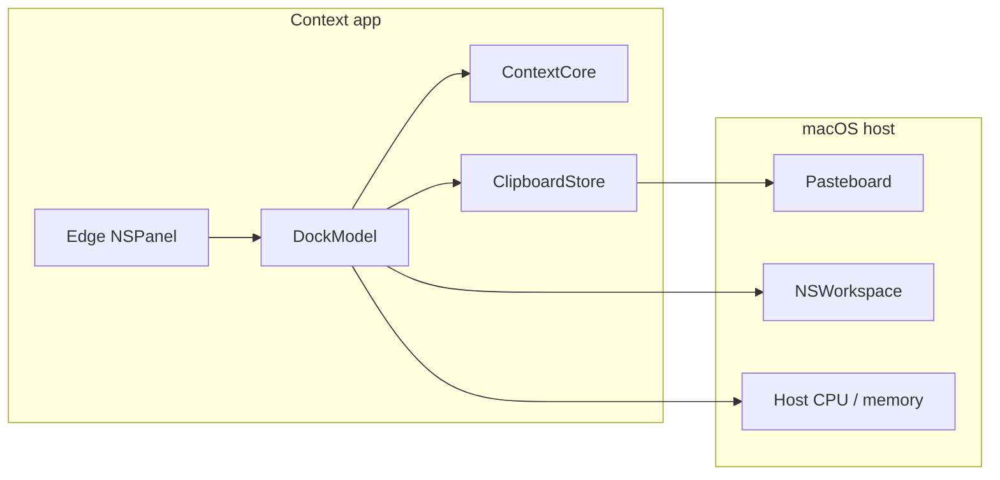

# How it works

Context is a floating edge panel plus a small set of widgets. Layout geometry matches the marketing site dock (66pt wide cells, 54pt tall).

## Architecture

## Layout

`ContextCore` owns the constants and stacking math:

- Panel width 66pt, cell height 54pt, icon 44pt (apps ~50pt)
- Corner radius 22pt, vertical padding 7pt
- Up to twelve non-divider items

The AppKit layer positions a borderless `NSPanel` from that math and mirrors light/dark palette tokens from the marketing CSS.

## Data flow

1. User clicks a cell → launcher opens an app bundle ID or URL.
2. Clipboard poller reads the general pasteboard → `ClipboardStore` dedupes and caps history.
3. Stats tick reads Mach host load → cell shows CPU and RAM percentages.
4. Optional auto-hide slides the panel off-edge until the pointer enters the reveal zone.

See [Widgets](widgets.md) for per-widget behavior.
