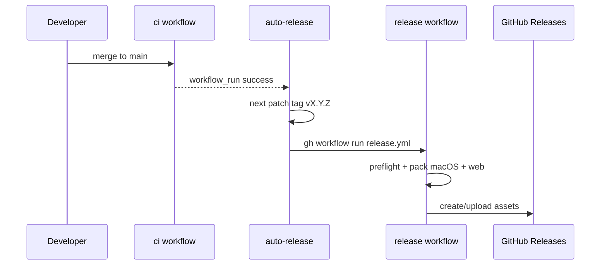

# Releasing

Context uses the same auto-release pattern as [hab](https://github.com/smeltery/hab).

## Flow

1. CI goes green on `main`.
2. `auto-release.yml` computes the next `vMAJOR.MINOR.PATCH` tag (or reuses one already on HEAD).
3. It dispatches `release.yml` with that tag (token-created tags do not trigger `on: push` alone).
4. Release builds `context-macos-arm64`, `context-web-*.tar.gz`, and `SHA256SUMS`.

Manual dispatch of `release.yml` is supported for rebuilds.
