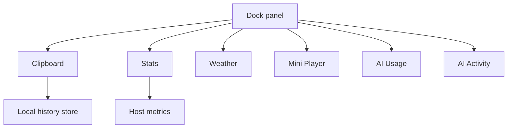

# Widgets

Widgets are dock cells that show live state and open a card or window on interaction.

## Clipboard

- Polls the pasteboard for text (and records metadata for images/files in the product roadmap).
- Keeps history on disk / defaults locally; clear history or remove the widget to delete it.
- Search and type filters match the marketing demo.

## Stats

- Shows the metrics you enable (CPU, GPU, RAM, SSD, and more in fuller builds).
- Click for a denser window; refresh interval is configurable.

## Weather / music / AI

- Weather uses location only when you add the widget.
- Mini Player talks to Music/Spotify via Automation when granted.
- AI Usage and AI Activity never read conversations; optional API keys stay in Keychain.

Privacy promises are summarized in [Privacy](privacy.md).
